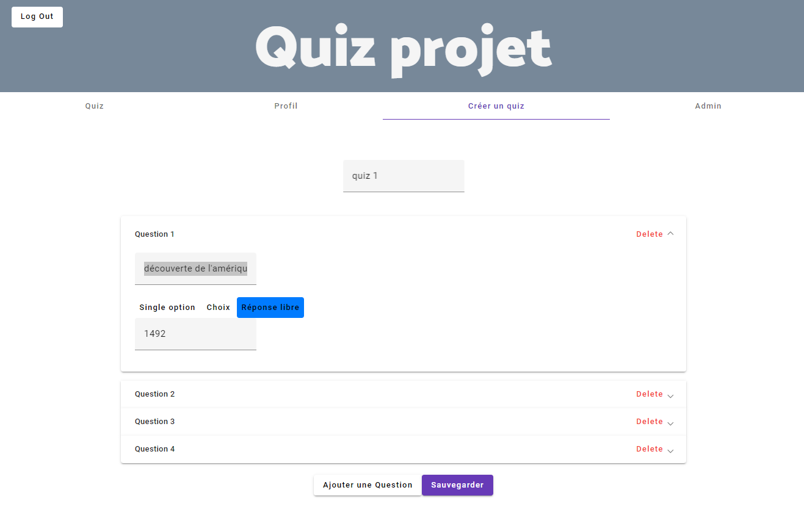
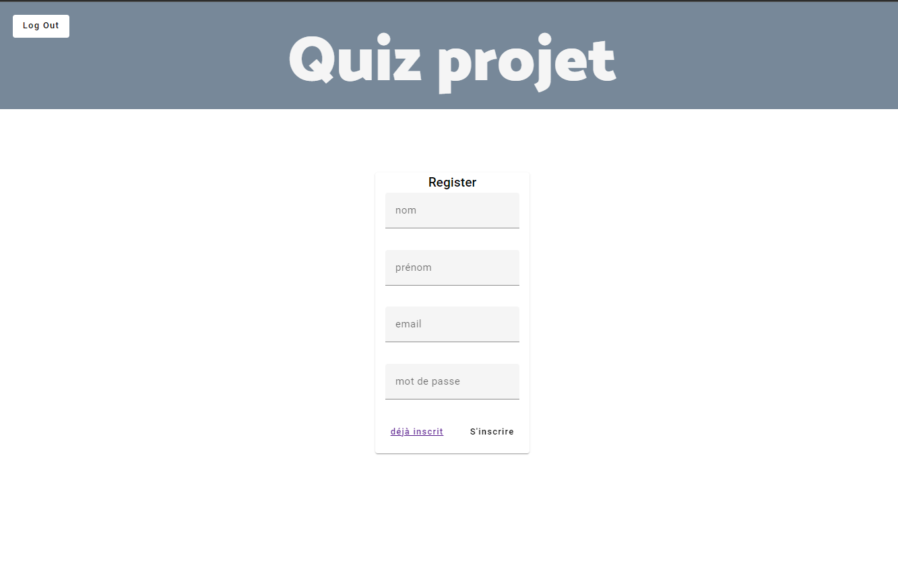
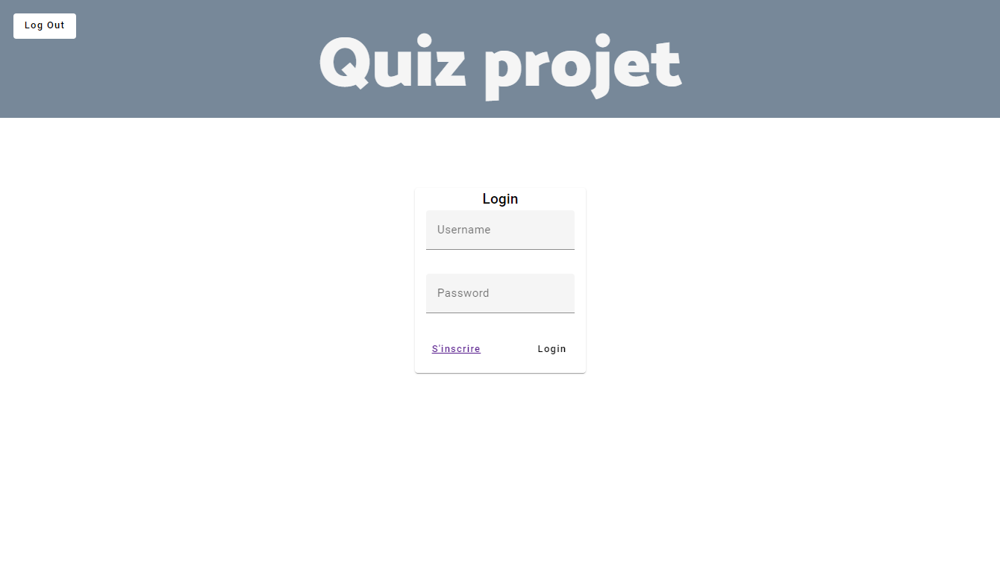
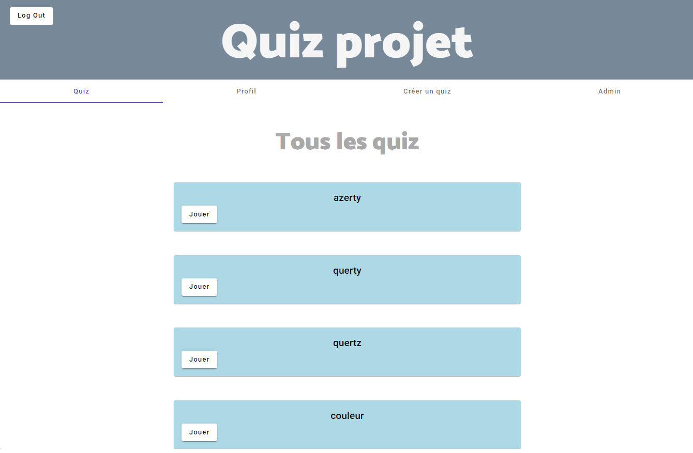
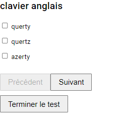
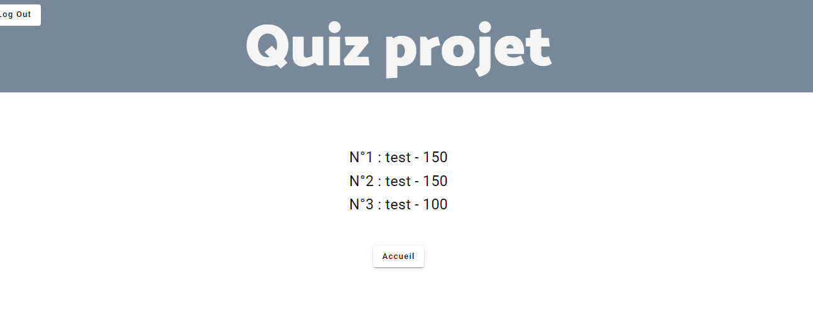
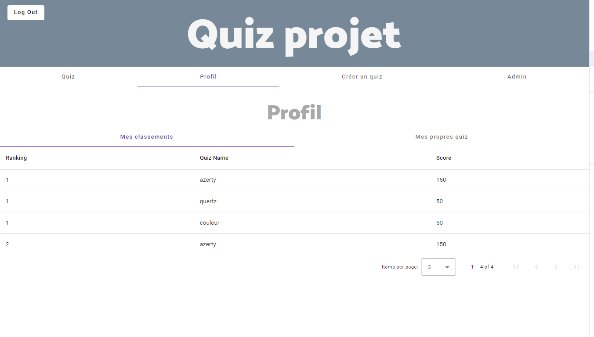
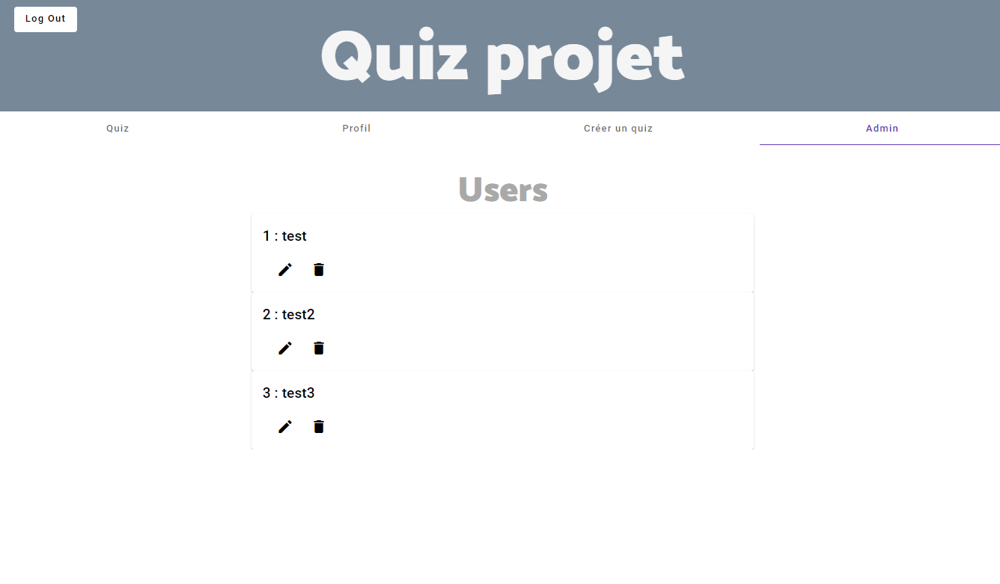

# Quiz Application
Bienvenue dans l'application de quiz! Cette application a été conçue pour permettre la création, la participation, et la gestion de quiz avec divers types de questions. Voici un aperçu des principales fonctionnalités et composants de l'application :

## Fonctionnalités Principales
### 1. Création de Quiz :

Vous avez la possibilité de créer des quiz personnalisés avec différents types de questions : QCM (questions à choix multiples), single option (question à choix unique), et input (questions à réponse textuelle).
### 2. Participation aux Quiz :

Explorez la page d'accueil pour découvrir la liste complète des quiz disponibles.
Participez à n'importe quel quiz qui suscite votre intérêt.
### 3. Calcul du Score :

À la fin de chaque quiz, votre score est calculé en fonction du nombre de bonnes réponses données.
### 4. Leaderboard :

Consultez le leaderboard pour voir les résultats de tous les participants à un quiz particulier.
Obtenez des informations sur les meilleurs scores et les performances des autres utilisateurs.
### 5. Espace Personnel :

Accédez à votre espace personnel pour voir la liste des quiz que vous avez complétés.
Consultez votre classement personnel pour chaque quiz.
## Authentification (Désactivée Temporairement)

À noter que l'option d'authentification a été temporairement désactivée. Cependant, le système d'authentification complet est disponible pour une utilisation future. Actuellement, les fonctionnalités d'inscription et de connexion sont accessibles via les URL "/register" et "/login", mais des erreurs de post et de requête sont présentes. Ces fonctionnalités seront réactivées une fois les problèmes résolus.

Ajout d'un authGuard (désactivé) qui permet de rediriger vers la page login lorsqu'on n'est pas authentifié

**A noter**
comme il y a deja un user dans la base de donnée, il faut créer 2 user, il y aura une erreur pour le premier le temps que l'index se positionne correctement.

## Guide d'Utilisation
### 1. Page d'Accueil :

Explorez la liste des quiz disponibles.
Sélectionnez un quiz pour y participer.
### 2. Participation à un Quiz :

Répondez aux différentes questions en fonction du type de quiz.
Soumettez vos réponses et obtenez votre score à la fin du quiz.
### 3. Leaderboard :

Consultez les scores des autres participants après avoir terminé un quiz.
Analysez vos performances par rapport à la communauté.
### 4. Espace Personnel :

Accédez à votre historique de quiz complétés.
Consultez votre classement personnel pour chaque quiz que vous avez fait.
## Page Admin (Actuellement Désactivée)

La page d'administration était initialement conçue pour gérer les utilisateurs, mais elle a été désactivée temporairement en raison de problèmes liés aux requêtes et aux posts. Cette fonctionnalité sera réactivée une fois les problèmes résolus.

## Remarques
* **Technologies Utilisées :**

L'application a été développée en utilisant Angular pour le frontend et Java (avec Spring Boot) pour le backend.
La persistance des données est assurée par une base de données.

* **Prochaines Étapes :**

Réactivation de l'authentification et de la page d'administration après résolution des problèmes techniques.

1. Mise en Évidence du Classement Personnel :
   Actuellement, le classement personnel pourrait être plus mis en évidence, en particulier pour les utilisateurs qui ont déjà participé plusieurs fois au même quiz. Nous pourrions envisager les améliorations suivantes :

Graphiques Visuels : Utilisation de graphiques ou de visualisations pour représenter le classement personnel au fil du temps.

Notifications Personnalisées : Envoi de notifications personnalisées pour informer les utilisateurs lorsqu'ils atteignent de nouveaux sommets dans leur classement personnel.

2. Amélioration de l'Aspect Graphique :
   Pour rendre l'expérience utilisateur plus attrayante et conviviale, nous pourrions explorer les options suivantes :

Refonte Graphique : Évaluation de l'interface utilisateur actuelle pour une refonte visuelle afin d'améliorer l'ergonomie et l'attrait esthétique.

3. Validation des Données :
   Afin d'assurer l'intégrité des données et de renforcer la qualité des informations traitées

Validation des Entrées Utilisateur : Renforcement de la validation des données côté frontend pour garantir que seules les données correctes et appropriées sont soumises.

Contraintes de Base de Données : Mise en place de contraintes supplémentaires au niveau de la base de données pour garantir la cohérence et la validité des données stockées.

6. Feedback Immédiat Après une Réponse :
   Rétroaction Visuelle : Fournir un feedback visuel immédiat après que l'utilisateur a soumis une réponse. Par exemple, en soumettant un formulaire, en créant un nouveau compte ou quiz.
Messages Explicatifs : Inclure des messages explicatifs pour accompagner la rétroaction visuelle, expliquant pourquoi une réponse est correcte ou incorrecte.

Rappels de Participation : Envoyer des rappels pour encourager les utilisateurs à participer à des quiz, surtout s'ils n'ont pas joué depuis un certain temps.
Bonne exploration et bonne chance pour les quiz! 🎓✨